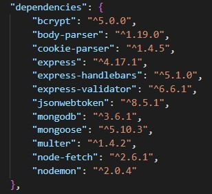

This is website for renting a car from private person for day(days) chosen by you. 
The project is created fully independent and without any support. 
For more visual information about application you can check photos-of-the-project folder 
< /> 
Implemented are basic CRUD(Create,Read,Update,Delete) operations. 
Website is responsive I used Bootstrap and CSS for this purpose. 
Handlebars is also used(Handlebars compiles templates into JavaScript functions). 

Packages(node_modules) which must to be installed to run the app. 
Packages are - npm install bcrypt body-parser cookie-parser express express-handlebars express-validator jsonwebtoken mongoose mongodb nodemon 
After installation on packages write in cmd or other terminal to run the server - npm(yarn) run start  

The website have several pages(home , shared-rent,offer-rent ,details-rent, offer-rent-edit, schedule-appointment,my-posts,login and register)) 
1.Home page is for all user who are guests of our app , to visit all other pages it's required to  have a account(registration). 
2.After you create your registration(account) you will be able to login with your credentials. 
3.You will be able to unlock the full potential of this application after your success login. 
4.After your login you will be redirect to shared-rent(page) with all availaible publications. 
5.Next step is if you click on make-rent(offer-rent page), in this page you can create(publicate)  your own publication of your car.You should fill the required form with details about your car
which you offer. 
6.If you do not want to create publication you can browse specific one as you click on blue button (Find Out More) , which will redirect you to Details page. 
7.In details page you can see information about this this car plus photo of rented car. 
If you are owner of this publication you will be able to either edit or delete this rent with  double red pair buttons(Edit this rent(edit) and Close this rent(delete)). 
If you are not owner you will be able to join this rent after you fill a form with day and time. 
After that you will be redirect to schedule-appointment page where you can check your schedule and  your current status about your request.Statuses are three ( Pending...(initial) , Approved and  Declined). The owner should first check your request and then to assess it.

